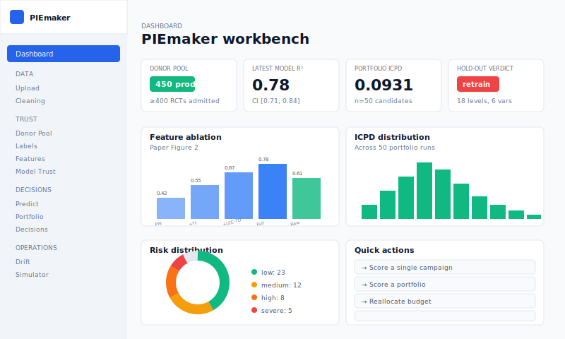
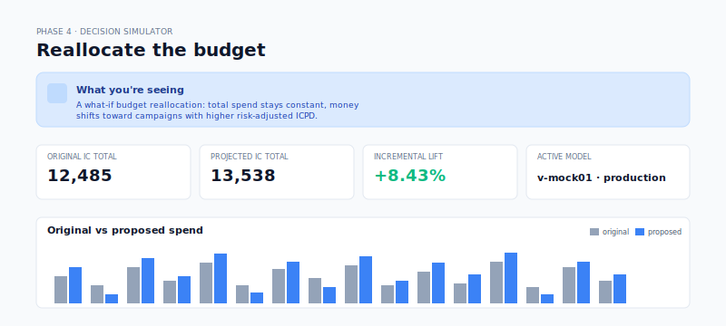
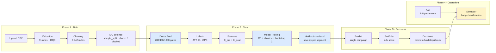
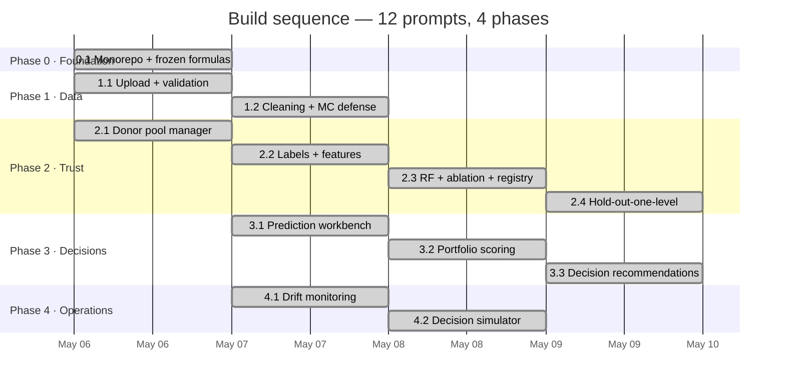
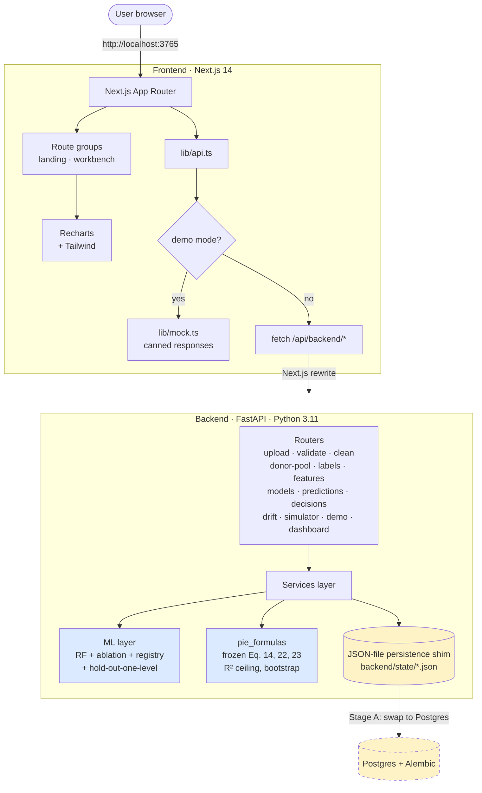

<p align="center">
  
</p>

<p align="center">
  <b>Predict campaign incrementality before you spend the budget.</b><br/>
  Built on Gordon, Moakler &amp; Zettelmeyer · NBER w35044 (2026)<br/>
  Made by <a href="https://github.com/matiyashu">Prima Hanura Akbar</a>
</p>

<p align="center">
  
  
  
  
  
</p>

---

## What is this?

**PIEmaker** is a campaign-level **incrementality prediction** workbench. You upload a media plan, it forecasts the *true* effect each campaign will have on conversions — not the inflated platform-attributed numbers, but the conversions that wouldn't have happened without the ad.

It does this by training a model on your historical **randomized controlled trials** (RCTs) and using that learned mapping to score new, non-RCT campaigns. The whole pipeline — donor pool curation, formula contracts, model trust diagnostics, decision recommendations, drift monitoring, budget simulation — ships in one dashboard.

**Why it matters.** Platform-reported CPAs include incidental conversions (people who would have converted anyway). The gap between attributed and incremental is exactly the budget that's being wasted on diminishing-return audiences. PIEmaker quantifies that gap *before* you commit budget.

> 💡 **The methodology comes from a real published paper.** Gordon, Moakler &amp; Zettelmeyer (2026) showed that a small set of features can predict incremental conversions per dollar (ICPD) with R² up to 0.88. PIEmaker is a faithful, end-to-end implementation of that paper as an internal advertiser tool.

---

## Quick start

### Try the demo (no install required)

The dashboard ships with a fully populated demo mode that doesn't need a backend. Two ways to access it:

**Option A — Live demo on Vercel** (frontend-only, mock data):
> Deploy your own with one click — see [Deployment](#deployment).

**Option B — Run locally:**
```bash
git clone https://github.com/matiyashu/PIEmaker-predicted-incrementality-by-experiment-.git
cd PIEmaker/frontend
npm install
npm run dev
# open http://localhost:3765 → click "Try demo mode"
```

The demo seeds 400 RCTs into a virtual donor pool, trains a production-band model, runs hold-out-one-level extrapolation on every segmentation variable, and scores 50 candidate campaigns — so every page in the sidebar is populated with realistic charts and numbers as soon as you click into it.

### Run the real pipeline

To train against your own data and serve real predictions you need both halves:

```bash
# Backend — FastAPI + sklearn + frozen formula contracts
cd PIEmaker/backend
python -m venv .venv && .venv/Scripts/activate          # Windows
# source .venv/bin/activate                             # macOS/Linux
pip install -e ".[dev]"
python -m uvicorn app.main:app --port 8000

# Frontend — in a second terminal
cd PIEmaker/frontend
npm install
npm run dev          # http://localhost:3765
```

Now visit `/dashboard`, click **Seed demo data** (~110 seconds), or upload your own CSV via `/upload` and walk through the pipeline.

---

## Screenshots

<table>
  <tr>
    <td width="50%"></td>
    <td width="50%"></td>
  </tr>
  <tr>
    <td align="center"><b>Dashboard</b><br/><sub>Hero metrics, ablation chart, ICPD histogram, risk distribution</sub></td>
    <td align="center"><b>Decision Simulator</b><br/><sub>What-if budget reallocation with cap multiplier and IC lift projection</sub></td>
  </tr>
</table>

---

## How it works

PIEmaker is a five-phase pipeline that mirrors how a measurement-mature ad team would actually build an incrementality forecaster:



The key architectural decision: **trust before UX**. The donor pool, frozen formula contracts, model diagnostics, and hold-out extrapolation tests all ship *before* the prediction UI. You can't run the simulator on a research-mode model — it's hard-blocked. You can't get an unwatermarked prediction from a model trained on <400 RCTs. The methodology comes first, the UX serves it.

### The core formulas (frozen contracts)

These live in [`backend/pie_formulas/`](backend/pie_formulas/) and are protected by 100% test coverage. Any change requires a design review and a model-registry version bump.

```
ATT  =  (Y_test/N_test - Y_control/N_control) / D̄                 Eq. 14
IC   =  ATT × D̄ × N_test                                          Eq. 22
ICPD =  IC / cost                                                  Eq. 23
```

`D̄` is the exposure rate (fraction of test users who actually saw the ad). Once you have `(ATT, IC, ICPD)` for every RCT in the donor pool, those are the *labels* a Random Forest learns to predict from a campaign's pre-determined features (objective, audience, vertical, planned spend...) and post-determined features (CTR, exposure rate, LCC-7d/$, conversions/$).

### Trust signals

Three diagnostics decide whether you should believe a forecast:

1. **Weighted R² + bootstrap CI** — how well the model explains ICPD variance (cost-weighted), with an uncertainty band from N=200 bootstrap resamples.
2. **R² ceiling** — theoretical upper bound from outcome noise (paper §5.2). If R² ≪ ceiling, the model is underfit; if R² ≈ ceiling, you're at the noise floor.
3. **Hold-out-one-level extrapolation** — for each level of a segmentation variable, train on every other level and score the held-out one. The R² gap reveals where the model is extrapolating onto thin ice. Severity bands: severe ≥ 25pp, high ≥ 15pp, medium ≥ 5pp, else low (paper Table 1).

A campaign whose `vertical=media` falls in the `severe` band gets auto-blocked from the simulator — the donor pool just doesn't cover that regime.

---

## The dashboard, page by page

The frontend is organized into four phase-grouped sections in the sidebar:

### Data
- **`/upload`** — drag-and-drop a CSV, get an `upload_id`, see schema-mapping suggestions.
- **`/cleaning`** — 8 cleaning rules audit-logged with before/after summaries; MC-defense mode tagged per RCT row.

### Trust
- **`/donor-pool`** — promote/demote RCTs, with quality scores (size × volume × duration × balance) and coverage heatmap. Aging indicator flags year-to-year drift (21pp R² penalty per the paper).
- **`/labels`** — ATT, IC, ICPD computed per RCT via the frozen formulas.
- **`/features`** — X_pre (16 fields, knowable before launch) and X_post (10 fields, post-mortem) feature engineering.
- **`/models`** — train, inspect ablation chart (paper Fig. 2), bootstrap CI, R² ceiling, LCC slope/ρ, run hold-out-one-level on every segmentation variable, promote to production.

### Decisions
- **`/predict`** — single-campaign forecast with confidence band and per-segment risk badges.
- **`/portfolio`** — bulk-score every non-RCT campaign in an upload; aggregates (mean/median/p10/p90 ICPD), risk donut, ICPD histogram.
- **`/decisions`** — risk-gated ranking with promote / hold / deprioritize / block action bands and projected portfolio lift.

### Operations
- **`/drift`** — Population Stability Index per feature; verdict aggregator (stable / watch / retrain_recommended).
- **`/simulator`** — what-if budget reallocation with cap multiplier; production-only (research models hard-blocked).

### Help
- **`/settings`** — toggle demo mode, see backend URL, clear localStorage.
- **`/faq`** — 9 methodology questions + 17-term glossary.

---

## Build plan v3 — phase status



V4 is coming soon!!

## What’s Coming in PIEmaker V4

PIEmaker V4 will focus on turning the current workbench into a more research-aligned, production-ready incrementality platform.

- **Paper-faithful model evaluation**
  - True out-of-fold weighted R²
  - 10-fold paper-mode cross-validation
  - Real campaign-cost weighting instead of proxy weights

- **Formula guardrails**
  - Locked ATT, IC, ICPD, weighted R², and disagreement formulas
  - Visual formula reference cards for future development
  - Clear separation between paper-backed metrics and PIEmaker extensions

- **Expanded model trust dashboard**
  - Predicted vs observed ICPD scatter plot
  - Residual diagnostics
  - Feature ablation chart with error bars
  - Donor-pool size vs R² curve
  - Feature importance / SHAP-style explanations

- **Attribution calibration tools**
  - Raw LCC-7D vs true ICPD calibration plot
  - Bias ratio by vertical and funnel
  - OLS slope and Spearman correlation diagnostics
  - Attribution-window comparison for 1h, 1d, 7d, and 28d LCC

- **Generalization and extrapolation testing**
  - Existing-advertiser vs new-advertiser validation
  - Hold-out-one-level tests for campaign year, advertiser size, vertical, audience type, custom audience, and conversion optimization
  - Full distribution views for within-segment vs extrapolated performance

- **Decision quality analytics**
  - Disagreement probability curves
  - Type I and Type II error breakdowns
  - PIE vs Raw LCC-7D decision comparison
  - Threshold sensitivity analysis

- **Shadow-RCT recommendations**
  - Coverage gap detection
  - Segment-level donor-pool health checks
  - Suggested RCTs for weak or high-risk model regions

- **Drift and monitoring upgrades**
  - Drift trends over time
  - PSI bin-contribution charts
  - Model performance across retraining versions
  - Better retraining recommendations

- **Production infrastructure**
  - Postgres persistence
  - MLflow/S3 model registry
  - Async training jobs with Celery/Redis
  - CI checks for backend tests, frontend build, and type safety

- **Governance and release safety**
  - Model cards
  - Run manifests
  - Promotion gates
  - Audit logs for donor-pool edits, model promotion, and simulator settings

---

## Architecture



### Layers

- **Frozen formulas** (`backend/pie_formulas/`) — pure functions for ATT, IC, ICPD, R² ceiling, bootstrap, LCC slope/ρ, weighted R². 100% test coverage.
- **ML** (`backend/ml/`) — Random Forest training pipeline, paper-Figure-2 ablation, file-based model registry (MLflow stand-in), hold-out-one-level extrapolation test.
- **Services** (`backend/services/`) — donor pool manager, label generator, feature engineering studio, MC-defense decider, validation rules, cleaning rules, prediction service, decision recommender, drift detector, simulator, demo seeder.
- **Routers** (`backend/app/routers/`) — thin FastAPI wrappers that map HTTP routes to services.
- **Persistence shim** (`backend/services/persistence.py`) — JSON-file table store with thread locking. Designed for swap-out to SQLAlchemy + Postgres in Stage A (see [Roadmap](#roadmap)).
- **Frontend API client** (`frontend/src/lib/api.ts`) — typed fetch wrappers for every backend endpoint, with a single dispatcher that short-circuits to mock data when demo mode is active.

---

## Tech stack

**Backend**
- FastAPI · Python 3.11 · scikit-learn · pandas · numpy · scipy
- pandera (data validation) · pytest (221 tests)
- File-based model registry (MLflow stand-in until Stage B)
- JSON-file persistence shim (Postgres-shaped; swap-out planned)

**Frontend**
- Next.js 14 App Router · TypeScript · Tailwind CSS
- Recharts (charts) · lucide-react (icons)
- Single-dispatcher mock layer for demo mode

**Infrastructure (planned)**
- Postgres 15 + Alembic migrations · Redis 7 · MLflow + S3
- Clerk auth · Celery for async training jobs
- Vercel (frontend) · Render or Fly.io (backend)

---

## Roadmap

The build plan is functionally complete. Production hardening is staged:

| Stage | Title | Status | What it does |
|---|---|---|---|
| 0 | Build plan v3 (12 prompts) | ✅ Complete | Formulas, validation, donor pool, model trust, predict, portfolio, decisions, drift, simulator |
| **A** | **Real persistence** | Up next | Postgres + Alembic migrations; swap the JSON-file shim |
| B | MLflow + S3 model artifacts | Planned | Replace pickle-to-disk with proper experiment tracking |
| C | Auth (Clerk) + per-user attribution | Planned | Role-gated promote/simulate; audit trails |
| D | Async / Celery + drift alerting | Planned | Long training as background jobs; nightly drift checks |
| E | Deploy (Vercel + Render/Fly + GH Actions) | Planned | Full production deployment |
| F | Observability (Sentry, governance log) | Optional | Compliance-ready audit surface |

---

## Repository layout

```
PIEmaker/
├── backend/
│   ├── app/
│   │   ├── main.py                  FastAPI entry point
│   │   ├── config.py                env-based settings
│   │   └── routers/                 13 routers (one per phase surface)
│   ├── pie_formulas/                frozen contracts (100% test coverage)
│   ├── ml/                          RF training, ablation, registry, hold-out
│   ├── services/                    business logic per workbench surface
│   ├── tests/                       221 pytest cases
│   ├── scripts/                     generate_demo_csv.py, smoke_phase2.py
│   └── alembic/                     migrations (placeholder for Stage A)
├── frontend/
│   ├── src/
│   │   ├── app/                     Next.js routes
│   │   │   ├── page.tsx             landing
│   │   │   └── (workbench)/         sidebar layout group
│   │   │       ├── dashboard/
│   │   │       ├── upload/ · cleaning/
│   │   │       ├── donor-pool/ · labels/ · features/ · models/
│   │   │       ├── predict/ · portfolio/ · decisions/
│   │   │       ├── drift/ · simulator/
│   │   │       └── settings/ · faq/
│   │   ├── components/              sidebar, summary-card, demo-mode-banner
│   │   └── lib/                     api.ts, mock.ts, demo-mode.ts, utils
│   ├── vercel.json                  pre-configured for demo-mode deploy
│   └── package.json
├── demo/
│   └── piemaker_demo.csv            450-row synthetic dataset
├── assets/                          banner + screenshot SVGs
├── docker-compose.yml               Postgres + Redis (Stage A)
└── README.md                        you are here
```

---

## Deployment

### Frontend on Vercel (demo mode, no backend)

The simplest deploy — useful for sharing screenshots, presentations, or any non-interactive showcase:

1. Fork the repo
2. Create a new Vercel project, point it at `frontend/` as the project directory
3. Vercel reads [`frontend/vercel.json`](frontend/vercel.json) and sets `NEXT_PUBLIC_FORCE_DEMO=1` automatically
4. Push to `main` — Vercel auto-deploys

Every page renders with realistic mock data; no backend traffic.

### Frontend on Vercel + backend on Render/Fly

For real predictions you need both halves running:

1. Deploy the backend somewhere that supports long-running stateful processes (Vercel serverless won't work — pickled model artifacts and JSON state files need persistent disk):
    - **Render**: web service with a `/data` mount for `backend/state/`
    - **Fly.io**: `fly launch` with a volume for the same
2. In Vercel project settings:
    - Remove `NEXT_PUBLIC_FORCE_DEMO` from `vercel.json` (or override it with `NEXT_PUBLIC_FORCE_DEMO=0`)
    - Set `NEXT_PUBLIC_BACKEND_URL=https://your-backend.example.com`
3. Re-deploy

---

## Contributing

This is a one-author research-and-build project at the moment. Issues and PRs are welcome but please open an issue first — the formulas in `backend/pie_formulas/` are explicitly frozen and changes there go through extra review.

---

## Credits & references

- **Methodology paper**: Brett R. Gordon, Eric Moakler &amp; Florian Zettelmeyer (2026). *Predicted Incrementality from Experiments: A Method to Forecast Ad Effectiveness*. NBER Working Paper [w35044](https://www.nber.org/papers/w35044).
- **Built by**: [Prima Hanura Akbar](https://github.com/matiyashu) · Jakarta · 2026.
- **License**: Open-source.

---

<p align="center">
  <sub>If this project is useful to you, ⭐ the repo. If you ship something with it, I'd love to hear about it.</sub>
</p>
