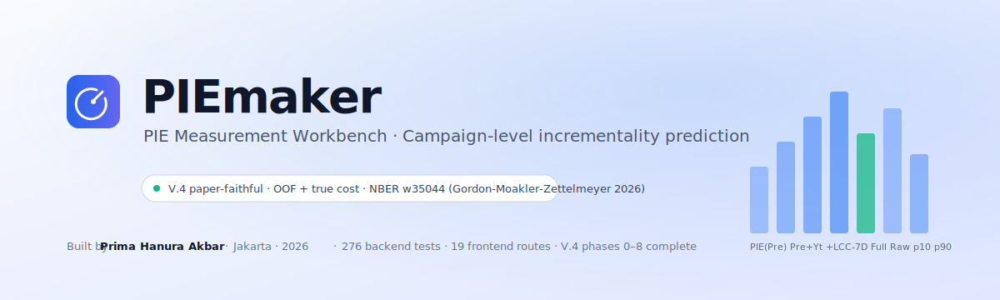
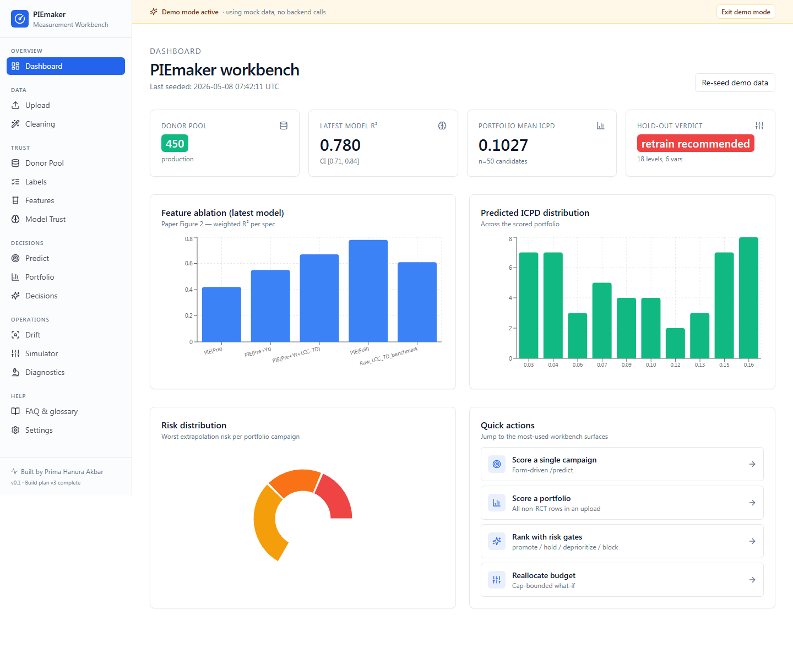
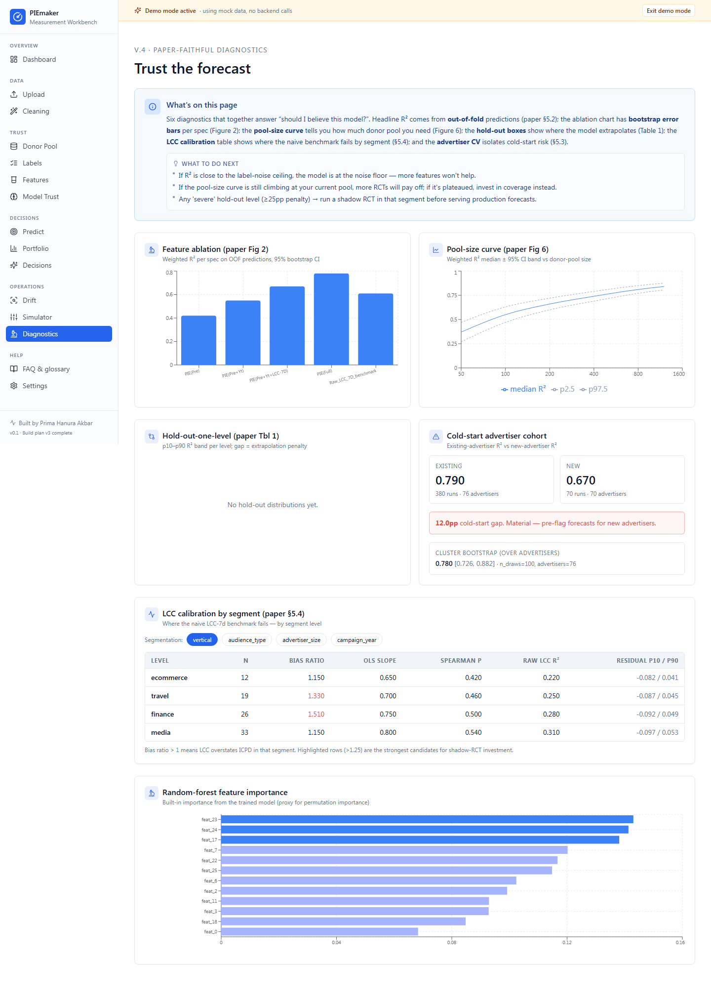
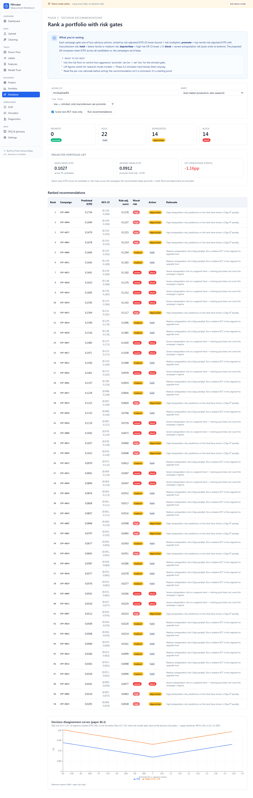
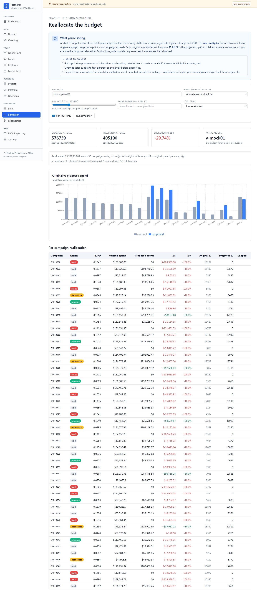
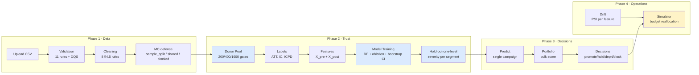
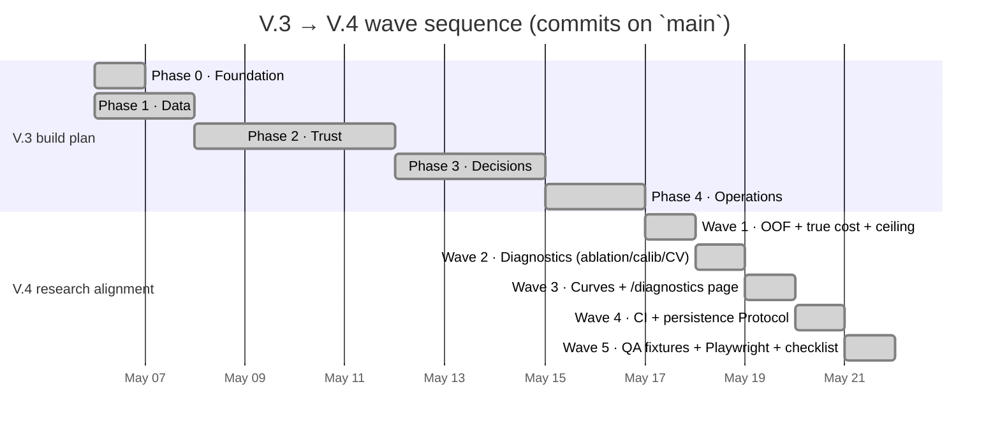
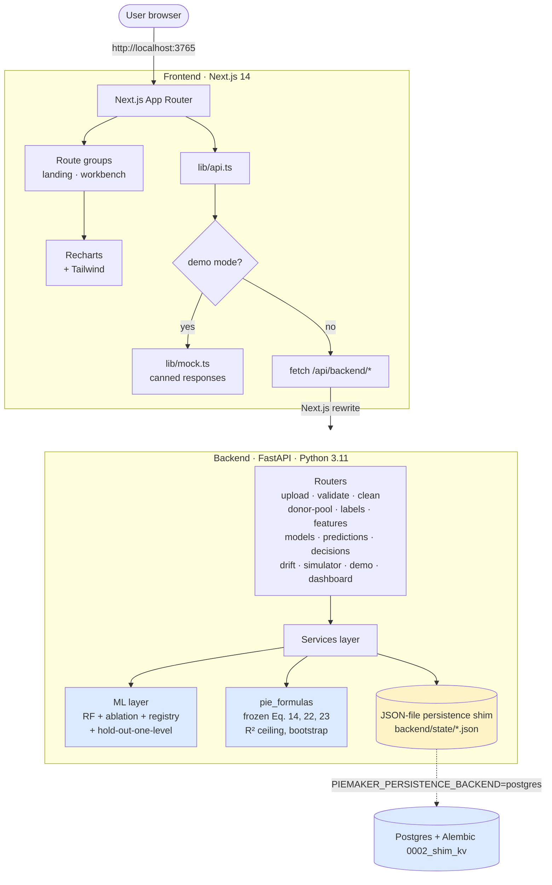

<p align="center">
  
</p>

<p align="center">
  <b>Predict campaign incrementality before you spend the budget.</b><br/>
  Built on Gordon, Moakler &amp; Zettelmeyer · NBER w35044 (2026)<br/>
  Made by <a href="https://github.com/matiyashu">Prima Hanura Akbar</a>
</p>

<p align="center">
  
  
  
  
  
  
</p>

<p align="center">
  <a href="https://vercel.com/new/clone?repository-url=https%3A%2F%2Fgithub.com%2Fmatiyashu%2FPIEmaker-predicted-incrementality-by-experiment-&root-directory=frontend">
    
  </a>
</p>

---

## What is this?

**PIEmaker** is a campaign-level **incrementality prediction** workbench. You upload a media plan, it forecasts the *true* effect each campaign will have on conversions — not the inflated platform-attributed numbers, but the conversions that wouldn't have happened without the ad.

It does this by training a model on your historical **randomized controlled trials** (RCTs) and using that learned mapping to score new, non-RCT campaigns. The whole pipeline — donor pool curation, formula contracts, model trust diagnostics, decision recommendations, drift monitoring, budget simulation — ships in one dashboard.

**Why it matters.** Platform-reported CPAs include incidental conversions (people who would have converted anyway). The gap between attributed and incremental is exactly the budget that's being wasted on diminishing-return audiences. PIEmaker quantifies that gap *before* you commit budget.

> 💡 **The methodology comes from a real published paper.** Gordon, Moakler &amp; Zettelmeyer (2026) showed that a small set of features can predict incremental conversions per dollar (ICPD) with R² up to 0.88. PIEmaker is a faithful, end-to-end implementation of that paper as an internal advertiser tool.

---

## Quick start

### Try the demo (no install required)

The dashboard ships with a fully populated demo mode that doesn't need a backend. Two ways to access it:

**Option A — Live demo on Vercel** (frontend-only, mock data):
> Deploy your own with one click — see [Deployment](#deployment).

**Option B — Run locally:**
```bash
git clone https://github.com/matiyashu/PIEmaker-predicted-incrementality-by-experiment-.git
cd PIEmaker/frontend
npm install
npm run dev
# open http://localhost:3765 → click "Try demo mode"
```

The demo seeds 400 RCTs into a virtual donor pool, trains a production-band model, runs hold-out-one-level extrapolation on every segmentation variable, and scores 50 candidate campaigns — so every page in the sidebar is populated with realistic charts and numbers as soon as you click into it.

### Run the real pipeline

To train against your own data and serve real predictions you need both halves:

```bash
# Backend — FastAPI + sklearn + frozen formula contracts
cd PIEmaker/backend
python -m venv .venv && .venv/Scripts/activate          # Windows
# source .venv/bin/activate                             # macOS/Linux
pip install -e ".[dev]"
python -m uvicorn app.main:app --port 8000

# Frontend — in a second terminal
cd PIEmaker/frontend
npm install
npm run dev          # http://localhost:3765
```

Now visit `/dashboard`, click **Seed demo data** (~110 seconds), or upload your own CSV via `/upload` and walk through the pipeline.

---

## Screenshots

Real captures of the running dashboard in demo mode.

<table>
  <tr>
    <td width="50%"></td>
    <td width="50%"></td>
  </tr>
  <tr>
    <td align="center"><b>Dashboard</b><br/><sub>Hero metrics, ablation chart, ICPD histogram, risk distribution donut</sub></td>
    <td align="center"><b>Diagnostics (V.4)</b><br/><sub>6 paper-faithful panels: ablation w/ error bars, pool-size curve, hold-out distributions, cold-start cohort, LCC calibration per segment, feature importance</sub></td>
  </tr>
  <tr>
    <td width="50%"></td>
    <td width="50%"></td>
  </tr>
  <tr>
    <td align="center"><b>Decisions</b><br/><sub>Risk-gated ranking + V.4 disagreement curves (PIE vs Raw LCC-7D over 0.5×–1.5× of segment median)</sub></td>
    <td align="center"><b>Decision Simulator</b><br/><sub>What-if budget reallocation with cap multiplier and IC lift projection</sub></td>
  </tr>
</table>

> Try them yourself: <a href="http://localhost:3765/diagnostics?demo=1"><code>/diagnostics?demo=1</code></a> · <a href="http://localhost:3765/decisions?demo=1"><code>/decisions?demo=1</code></a> · <a href="http://localhost:3765/simulator?demo=1"><code>/simulator?demo=1</code></a>

---

## How it works

PIEmaker is a five-phase pipeline that mirrors how a measurement-mature ad team would actually build an incrementality forecaster:



The key architectural decision: **trust before UX**. The donor pool, frozen formula contracts, model diagnostics, and hold-out extrapolation tests all ship *before* the prediction UI. You can't run the simulator on a research-mode model — it's hard-blocked. You can't get an unwatermarked prediction from a model trained on <400 RCTs. The methodology comes first, the UX serves it.

### The core formulas (frozen contracts)

These live in [`backend/pie_formulas/`](backend/pie_formulas/) and are protected by 100% test coverage. Any change requires a design review and a model-registry version bump.

```
ATT  =  (Y_test/N_test - Y_control/N_control) / D̄                 Eq. 14
IC   =  ATT × D̄ × N_test                                          Eq. 22
ICPD =  IC / cost                                                  Eq. 23
```

`D̄` is the exposure rate (fraction of test users who actually saw the ad). Once you have `(ATT, IC, ICPD)` for every RCT in the donor pool, those are the *labels* a Random Forest learns to predict from a campaign's pre-determined features (objective, audience, vertical, planned spend...) and post-determined features (CTR, exposure rate, LCC-7d/$, conversions/$).

### Trust signals (V.4 paper-faithful)

Six diagnostics decide whether you should believe a forecast — each lives on the [`/diagnostics`](#) page with its own panel:

1. **Weighted OOF R² + 1000-bootstrap CI** — how well the model explains ICPD variance (cost-weighted), computed on **out-of-fold predictions** with a paper-default 1000-draw bootstrap. V.4 calls this out explicitly: in-sample R² is no longer accepted as the headline number.
2. **R² ceiling from label noise** — derived from per-RCT ATT standard errors (Bernoulli difference-of-proportions, paper §3.1 fn. 21), not the model's residual variance. If R² ≪ ceiling, the model is underfit; if R² ≈ ceiling, you're at the noise floor.
3. **Hold-out-one-level extrapolation distributions** — for each level of a segmentation variable, train on every other level and score the held-out one. V.4 stores the **full R² distribution** per level, not just the median. Severity bands: severe ≥ 25pp, high ≥ 15pp, medium ≥ 5pp, else low (paper Table 1).
4. **Cold-start advertiser cohort** — existing-vs-new advertiser R² split via `GroupKFold`, plus a **cluster bootstrap** that resamples advertisers (not rows) for honest CIs (paper §5.3).
5. **LCC calibration per segment** — bias ratio, OLS slope, Spearman ρ, raw LCC R², residual band — per segment level. Surfaces where the naive LCC-7d benchmark structurally fails (paper §5.4).
6. **Decision-disagreement curves** — D(t) scanned over 0.5×–1.5× of segment median ICPD, with Type I / Type II decomposition, PIE vs Raw-LCC-7D side by side (paper §6.3).

A campaign whose `vertical=media` falls in the `severe` band gets auto-blocked from the simulator — the donor pool just doesn't cover that regime. Every registered model carries a **model card** declaring its paper-alignment (eval_mode, n_splits, n_bootstrap, weights_source, headline_r2_basis, r2_ceiling_method); models trained with deviations (e.g. proxy weights) are visibly flagged in the trust UI.

---

## The dashboard, page by page

The frontend is organized into four phase-grouped sections in the sidebar:

### Data
- **`/upload`** — drag-and-drop a CSV, get an `upload_id`, see schema-mapping suggestions.
- **`/cleaning`** — 8 cleaning rules audit-logged with before/after summaries; MC-defense mode tagged per RCT row.

### Trust
- **`/donor-pool`** — promote/demote RCTs, with quality scores (size × volume × duration × balance) and coverage heatmap. Aging indicator flags year-to-year drift (21pp R² penalty per the paper).
- **`/labels`** — ATT, IC, ICPD computed per RCT via the frozen formulas.
- **`/features`** — X_pre (16 fields, knowable before launch) and X_post (10 fields, post-mortem) feature engineering.
- **`/models`** — train, inspect ablation chart (paper Fig. 2), bootstrap CI, R² ceiling, LCC slope/ρ, run hold-out-one-level on every segmentation variable, promote to production.

### Decisions
- **`/predict`** — single-campaign forecast with confidence band and per-segment risk badges.
- **`/portfolio`** — bulk-score every non-RCT campaign in an upload; aggregates (mean/median/p10/p90 ICPD), risk donut, ICPD histogram.
- **`/decisions`** — risk-gated ranking with promote / hold / deprioritize / block action bands and projected portfolio lift.

### Operations
- **`/drift`** — Population Stability Index per feature; verdict aggregator (stable / watch / retrain_recommended).
- **`/simulator`** — what-if budget reallocation with cap multiplier; production-only (research models hard-blocked).

### Help
- **`/settings`** — toggle demo mode, see backend URL, clear localStorage.
- **`/faq`** — 9 methodology questions + 17-term glossary.

---

## Build status — V.4 phases 0–8 complete

The original V.3 build plan shipped the workbench. **V.4 closed the research-alignment gaps** uncovered by the paper/code review: every headline number now comes from true out-of-sample evaluation, and the dashboard surfaces the diagnostics needed to defend a PIE forecast.



### What V.4 actually shipped

Five waves landed against `main`. Each fixes a specific paper-alignment gap surfaced during the review.

| Wave | Commit | Δ tests | What changed |
|---|---|---|---|
| 1 — Foundation | `33f22ed` | +9 → 230 | Out-of-fold R² (was in-sample), **true campaign cost** as weight (was 1/conversions_per_dollar proxy), **label-noise** R² ceiling (was residual variance), 10-fold CV default (was 5), 1000-bootstrap default (was 200). Composite feature_store key + 3 new X_pre fields (`advertiser_id`, `advertiser_size`, `campaign_year`). Real `sample_split` path when user-level data is available. New `paper_to_code_matrix.json` + `ModelCardCriteria` schema. |
| 2 — Diagnostics | `34204fe` | +13 → 243 | Ablation rebuilt on OOF with **1000-bootstrap CI per spec** (paper Fig 2 with error bars). Sample-size curve (paper Fig 6). LCC calibration **per segment** with bias ratio / OLS slope / Spearman ρ / raw LCC R² / residual band. Hold-out-one-level now returns **full distributions** not just medians. Existing-vs-new advertiser CV. Cluster bootstrap over advertisers. 5 new router endpoints. |
| 3 — Curves + UI | `9260f00` | +5 → 248 | Decision-disagreement curves (PIE vs Raw-LCC-7D over 0.5×–1.5× of segment median, paper §6.3). New **`/diagnostics` page** consolidating 6 panels. Disagreement curves chart on `/decisions`. Mock layer extended for every new endpoint. |
| 4 — Hardening foundation | `145d8be` | +10 → 258 | Full **CI workflow** (pytest + frontend build). `PersistenceBackend` Protocol with `FileShim` (default) + **`PostgresBackend`** (production option, gated by env vars). Alembic `0002_shim_kv` JSONB migration. **Run manifest** on every model registration: git SHA, paper-alignment version, hyperparameters, model card criteria. |
| 5 — QA + release | `35bf1cf` | +18 → **276** | Six tuned **edge-case fixtures**: perfect_compliance, one_sided_noncompliance, sample_split, high_lcc_bias, cold_start_advertisers, severe_extrapolation — each tripping a specific V.4 diagnostic. **Playwright smoke** covering 15 routes in demo mode. V.4 **migration checklist** in this README's appendix. |

**Paper-faithful evaluation contract — what V.4 enforces:**
- Headline weighted R² is computed from **OOF predictions**, not full-data refits. The V.4 number will be visibly lower than the V.3 number; that's the cost of honesty.
- The cost weight is the **actual campaign cost** from the upload, not a proxy. Mismatched callers surface a deviation badge on the model card.
- The R² ceiling is derived from **per-RCT label noise** (Bernoulli difference-of-proportions on ATT, paper §3.1 fn. 21), not the model's residual variance.
- Every registered model carries a **run manifest** (git SHA + paper-alignment version + criteria) so a model can be re-derived deterministically.
- Five paper-faithful charts now ship on `/diagnostics`: ablation w/ error bars, pool-size curve, hold-out distributions, advertiser cohort, LCC calibration per segment.

### Deferred to V.4 Wave 4B

The Protocol + migration scaffolding are in place; activating them needs running infrastructure to test honestly.

- Switch demo seed + production callers to `PostgresBackend` (set `PIEMAKER_PERSISTENCE_BACKEND=postgres` + `DATABASE_URL`)
- MLflow + S3 model artifacts (replace pickle-to-disk in `ml/model_registry.py`)
- Celery + Redis for long-running endpoints (`/api/models/train`, `/api/models/sample-size-curve`, `/api/models/holdout-one-level` at full paper-mode iterations)
- Clerk auth + per-user audit attribution
- Governance log compliance surface

---

## Architecture



V.4 Wave 4 shipped the Protocol — `services/persistence.py` now resolves to either `FileShim` (default) or `PostgresBackend` based on the env var. Same callback surface, same shim semantics; the JSONB key-value table from Alembic `0002_shim_kv` lets every service swap from file to SQL without rewriting any read/write call.

### Layers

- **Frozen formulas** (`backend/pie_formulas/`) — pure functions for ATT, IC, ICPD, R² ceiling, bootstrap, LCC slope/ρ, weighted R². 100% test coverage.
- **ML** (`backend/ml/`) — Random Forest training pipeline, paper-Figure-2 ablation, file-based model registry (MLflow stand-in), hold-out-one-level extrapolation test.
- **Services** (`backend/services/`) — donor pool manager, label generator, feature engineering studio, MC-defense decider, validation rules, cleaning rules, prediction service, decision recommender, drift detector, simulator, demo seeder.
- **Routers** (`backend/app/routers/`) — thin FastAPI wrappers that map HTTP routes to services.
- **Persistence shim** (`backend/services/persistence.py`) — JSON-file table store with thread locking. Designed for swap-out to SQLAlchemy + Postgres in Stage A (see [Roadmap](#roadmap)).
- **Frontend API client** (`frontend/src/lib/api.ts`) — typed fetch wrappers for every backend endpoint, with a single dispatcher that short-circuits to mock data when demo mode is active.

---

## Tech stack

**Backend**
- FastAPI · Python 3.11 · scikit-learn · pandas · numpy · scipy
- pandera (data validation) · pytest (**276 tests** as of V.4 Wave 5)
- File-based model registry (MLflow stand-in; full MLflow swap is Wave 4B)
- Persistence Protocol: `FileShim` (default) + `PostgresBackend` (live behind env var, **Wave 4** ✅)

**Frontend**
- Next.js 14 App Router · TypeScript · Tailwind CSS
- Recharts (charts) · lucide-react (icons)
- Single-dispatcher mock layer for demo mode
- Playwright smoke tests (Wave 5) ✅

**Infrastructure**
- Postgres 15 + Alembic (migrations 0001 typed + 0002 shim_kv) ✅
- GitHub Actions CI: full pytest + frontend build + Playwright smoke + strict formula-contracts gate ✅
- *Planned (Wave 4B)*: Redis 7 + MLflow + S3 + Clerk auth + Celery for async jobs
- Vercel (frontend) · Render or Fly.io (backend)

---

## Roadmap

V.3 build plan + V.4 research alignment are both functionally complete. The remaining work is production-infrastructure activation.

| Stage | Status | What it does |
|---|---|---|
| V.3 build plan (12 prompts, 4 phases) | ✅ Complete | Formulas, validation, donor pool, model trust, predict, portfolio, decisions, drift, simulator |
| **V.4 Waves 1–5** (Phases 0–8) | ✅ **Complete** | OOF evaluation, true cost weights, label-noise ceiling, paper-faithful diagnostics, `/diagnostics` page, CI, persistence Protocol, run manifests, edge-case fixtures, Playwright smoke |
| V.4 Wave 4B — Postgres cutover | Up next | Switch demo seed + prod callers to `PostgresBackend`; replace `model_registry.py` pickle-to-disk with MLflow + S3 |
| V.4 Wave 4B — Async jobs | Planned | Celery + Redis for `/api/models/train`, `/api/models/sample-size-curve`, `/api/models/holdout-one-level` at full paper-mode iterations |
| V.4 Wave 4B — Auth + governance | Planned | Clerk JWT middleware, per-user audit attribution, governance log compliance surface |
| Deploy hardening | Planned | Vercel (frontend live) + Render/Fly (backend live), Sentry, rate limiting |

---

## Repository layout

```
PIEmaker/
├── .github/workflows/               formula-contracts.yml + ci.yml (V.4 Wave 4)
├── backend/
│   ├── app/
│   │   ├── main.py                  FastAPI entry point
│   │   ├── config.py                env-based settings
│   │   └── routers/                 13 routers; /api/models has 5 new V.4 endpoints
│   ├── pie_formulas/                frozen contracts + paper_to_code_matrix.json
│   │   ├── labels.py · evaluation.py · decision.py · decision_curves.py (V.4)
│   │   ├── model_card_schema.py (V.4) · run_manifest.py (V.4)
│   │   └── paper_to_code_matrix.json (V.4)
│   ├── ml/                          training pipeline + V.4 diagnostics
│   │   ├── train_random_forest.py · feature_ablation.py · model_registry.py
│   │   ├── holdout_one_level.py · sample_size_curve.py (V.4)
│   │   ├── lcc_calibration_by_segment.py (V.4)
│   │   ├── advertiser_cv.py (V.4) · bootstrap_advertisers.py (V.4)
│   ├── services/                    business logic incl. persistence Protocol
│   │   ├── persistence.py           FileShim + PostgresBackend (V.4 Wave 4)
│   │   └── …
│   ├── tests/                       276 pytest cases (V.4 Wave 5)
│   │   ├── fixtures/                6 edge-case fixture builders (V.4 Wave 5)
│   │   └── test_v4_fixtures.py · test_oof_evaluation.py · test_wave2_diagnostics.py · …
│   ├── scripts/                     generate_demo_csv.py, smoke_phase2.py
│   └── alembic/versions/            0001_initial_schema + 0002_shim_kv (V.4 Wave 4)
├── frontend/
│   ├── src/
│   │   ├── app/                     Next.js routes
│   │   │   ├── page.tsx             landing
│   │   │   └── (workbench)/         sidebar layout group
│   │   │       ├── dashboard/ · diagnostics/ (V.4 Wave 3)
│   │   │       ├── upload/ · cleaning/
│   │   │       ├── donor-pool/ · labels/ · features/ · models/
│   │   │       ├── predict/ · portfolio/ · decisions/
│   │   │       ├── drift/ · simulator/
│   │   │       └── settings/ · faq/
│   │   ├── components/              sidebar, summary-card, demo-mode-banner
│   │   └── lib/                     api.ts, mock.ts, demo-mode.ts
│   ├── e2e/                         Playwright specs (V.4 Wave 5)
│   ├── playwright.config.ts
│   ├── vercel.json                  pre-configured for demo-mode deploy
│   └── package.json
├── demo/piemaker_demo.csv           450-row synthetic dataset (3 calendar years)
├── assets/                          banner.svg + 6 screenshot PNGs
├── docker-compose.yml               Postgres + Redis (Wave 4B target)
└── README.md                        you are here
```

---

## Deployment

### Frontend on Vercel (demo mode, no backend)

The Next.js app lives in `frontend/`, so Vercel needs to be told where to find it. There is **one supported path** — set the Root Directory.

1. Fork the repo (or use yours).
2. At https://vercel.com/new, click **Import** on the repo.
3. **Set Root Directory to `frontend`** in the import wizard. This is the critical step — if you leave it blank, Vercel will try to deploy the monorepo root, fail to find `next` in any `package.json`, and you'll get either `404 NOT_FOUND` (silent empty deploy) or `No Next.js version detected` (framework auto-detection error).
4. Leave Framework Preset as auto-detected (Vercel will say "Next.js").
5. Click **Deploy**.

Vercel now reads [`frontend/vercel.json`](frontend/vercel.json) directly, auto-detects Next.js from `frontend/package.json`, and sets `NEXT_PUBLIC_FORCE_DEMO=1` automatically. First build takes ~2 minutes; every page then renders with realistic mock data.

**One-click deploy:** the badge at the top of this README links to a pre-filled import URL with `root-directory=frontend` already set.

**Fixing an existing project that's hitting the error:** Vercel project → **Settings → General → Root Directory** → set to `frontend` → Save → trigger a redeploy (Deployments → ⋯ → Redeploy).

If you see Vercel's `404: NOT_FOUND` page after importing the repo, the project was deployed from the repository root. Open **Project Settings -> Build and Deployment -> Root Directory**, set it to `frontend`, save, and redeploy. Leave the Output Directory empty so Vercel uses Next.js' default `.next` output.

### Frontend on Vercel + backend on Render/Fly

For real predictions you need both halves running:

1. Deploy the backend somewhere that supports long-running stateful processes (Vercel serverless won't work — pickled model artifacts and JSON state files need persistent disk):
    - **Render**: web service with a `/data` mount for `backend/state/`
    - **Fly.io**: `fly launch` with a volume for the same
2. In Vercel project settings:
    - Override `NEXT_PUBLIC_FORCE_DEMO` to `0` (or remove the line from whichever `vercel.json` your deploy reads)
    - Set `NEXT_PUBLIC_BACKEND_URL=https://your-backend.example.com`
3. Re-deploy

### Troubleshooting Vercel imports

The two failure modes look different but have the same root cause: Vercel's Root Directory is the repo root instead of `frontend/`.

| Error you see | What Vercel did |
|---|---|
| `404: NOT_FOUND` with an ID like `sfo1::8zff2-…` | Build silently produced no output. Vercel deployed an empty shell; every URL hits the edge 404. |
| `No Next.js version detected. Make sure your package.json has "next" in either "dependencies" or "devDependencies"` | Vercel's framework auto-detection looked for `next` in the package.json at the configured root — found no `package.json` there at all, or one without Next.js. |

**Fix (both errors):** Vercel project → **Settings → General → Root Directory** → set to `frontend` → Save → Deployments → ⋯ → Redeploy.

**Other things to check:**
- Build logs in Vercel → Deployments → latest → "Build" tab. A red build means install or compile failed — read the log.
- Confirm the deploy URL you're hitting is the latest deploy and not an older preview.
- The Framework Preset in Vercel settings should say **Next.js** (auto-detected when Root Directory is `frontend`). If it says "Other", Root Directory is still wrong.

---

## Contributing

This is a one-author research-and-build project at the moment. Issues and PRs are welcome but please open an issue first — the formulas in `backend/pie_formulas/` are explicitly frozen and changes there go through extra review.

---

## Credits & references

- **Methodology paper**: Brett R. Gordon, Eric Moakler &amp; Florian Zettelmeyer (2026). *Predicted Incrementality from Experiments: A Method to Forecast Ad Effectiveness*. NBER Working Paper [w35044](https://www.nber.org/papers/w35044).
- **Built by**: [Prima Hanura Akbar](https://github.com/matiyashu) · Jakarta · 2026.
- **License**: Open-source.

---

## V.4 migration checklist

For operators upgrading an existing PIEmaker deployment from V.3 to V.4. Walk this list once per environment.

### Code

- [ ] `git pull` to V.4 head (commit ≥ `145d8be`).
- [ ] Backend: `pip install -e ".[dev]"` to pick up SQLAlchemy / Alembic.
- [ ] Frontend: `npm install` for `@playwright/test` (CI runs Playwright smoke now).

### Data — feature_store schema

The V.4 feature_store row carries new fields. Existing rows in `backend/state/feature_store.json` are still readable but cannot be used for paper-mode training until they're regenerated.

- [ ] Re-run `services.feature_engineering_service.build_features` on every active upload so each row carries: composite `id` key (`campaign_id|version|mode`), top-level `cost`, and the three new X_pre columns (`advertiser_id`, `advertiser_size`, `campaign_year`).
- [ ] Verify with: `python -c "from services.persistence import read_table; rows = read_table('feature_store'); print({'has_id': all('id' in r for r in rows), 'has_cost': all('cost' in r for r in rows)})"`

### Data — rct_labels schema

V.4 persists per-arm Sample-1 / Sample-2 counts so the label-noise R² ceiling can be computed.

- [ ] Re-run `services.label_generation_service.generate_labels` on every RCT.
- [ ] Confirm new fields: `sample_1_test_users`, `sample_1_control_users`, `sample_1_test_conversions`, `sample_1_control_conversions`, `sample_1_exposed_test_users`, `sample_2_test_users`, `sample_2_control_users`, `sample_2_exposed_test_users`, `sample_2_test_conversions`, `sample_2_control_conversions`, `cost`.

### Models — re-train against V.4 evaluation

V.4 changes the headline R²: in-sample → OOF, 5-fold → 10-fold, 200 → 1000 bootstrap draws, proxy → true cost weights, residual → label-noise ceiling. Existing model registry entries will report different numbers under the new harness — **do not compare V.3 and V.4 R² values directly**.

- [ ] For every model in `model_versions.json`, retrain via `train_pie_model()` with V.4 defaults. The fresh `weighted_r_squared` will be lower than the V.3 number (OOF is honest, in-sample isn't).
- [ ] Verify model cards: `paper_aligned: true` and an empty `deviations: []` on every production-band model.
- [ ] Run hold-out-one-level on `campaign_year` and `advertiser_size` (V.4 added them). Persist via `POST /api/models/holdout-one-level`.
- [ ] Re-run portfolio scoring so `prediction_runs` rows are tagged with the new model versions.

### Database (optional — Wave 4B)

If you're swapping the JSON shim for Postgres:

- [ ] Spin up Postgres (docker-compose has it) and set `DATABASE_URL`.
- [ ] Run `cd backend && alembic upgrade head` — applies `0001_initial_schema` (typed) + `0002_shim_kv` (JSONB key-value, used by `PostgresBackend`).
- [ ] Set `PIEMAKER_PERSISTENCE_BACKEND=postgres` in the runtime environment.
- [ ] Verify with `from services.persistence import get_backend; print(type(get_backend()).__name__)` → should print `PostgresBackend`.
- [ ] Migrate state: read each shim JSON file, upsert every row into the new backend.

### CI / Vercel

- [ ] Verify [`.github/workflows/ci.yml`](.github/workflows/ci.yml) runs on a PR (backend pytest fast + demo-seed + frontend build + Playwright smoke).
- [ ] Confirm [`.github/workflows/formula-contracts.yml`](.github/workflows/formula-contracts.yml) is still required as the strict gate on `pie_formulas/`.
- [ ] Vercel: bump `NEXT_PUBLIC_BACKEND_URL` if your backend URL changed; demo mode (`NEXT_PUBLIC_FORCE_DEMO=1`) requires no changes.

### Verification (final)

- [ ] `cd backend && pytest tests/` — all V.4 tests green (target: 276 passing for the Wave 5 ship).
- [ ] `cd frontend && npm run build` — clean build, all routes present.
- [ ] Visit `/diagnostics?demo=1` in the browser — six paper-faithful panels render with mock data.
- [ ] Visit `/decisions?demo=1` — disagreement curves chart appears at the bottom.
- [ ] If `PIEMAKER_PERSISTENCE_BACKEND=postgres` is set, run the full pipeline end-to-end and confirm `model_versions.json` has gained the new run_manifest field.

---

<p align="center">
  <sub>If this project is useful to you, ⭐ the repo. If you ship something with it, I'd love to hear about it.</sub>
</p>
